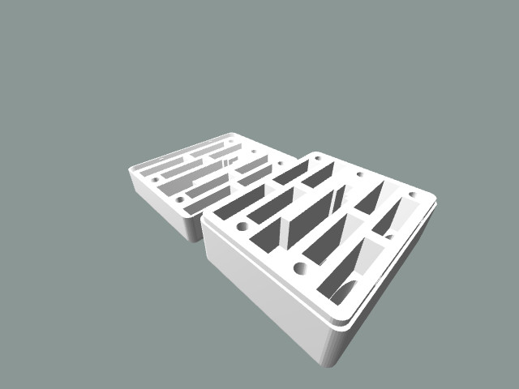

# Framework Laptop Expansion Card Case

A case generator for Framework expansion cards.

The case may be configured to have any number of rows/columns and include an RJ45 adapter in any position along with numerous other configurations.

Give it a try at https://ayowel.github.io/openscad-framework-usb-box/.

